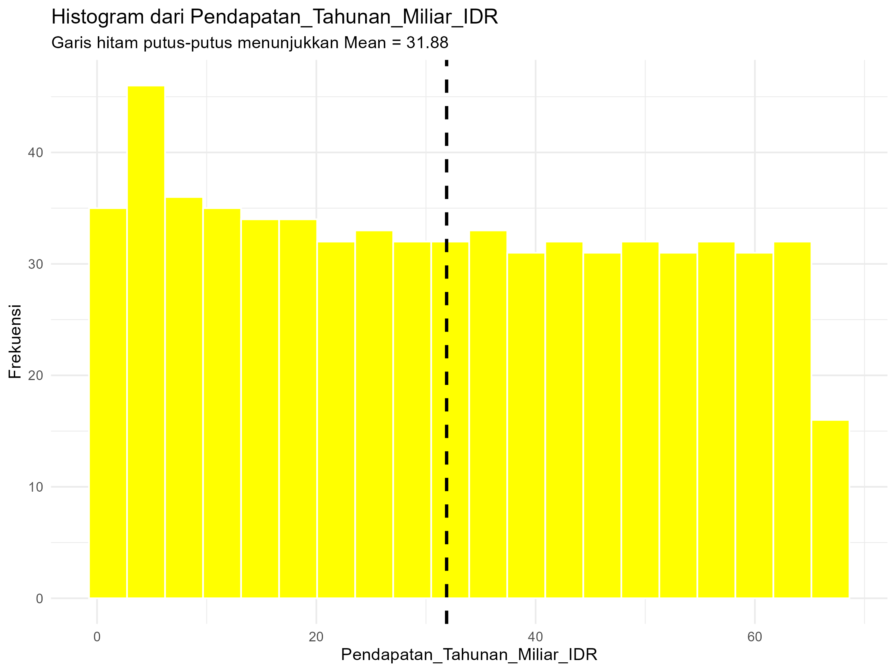
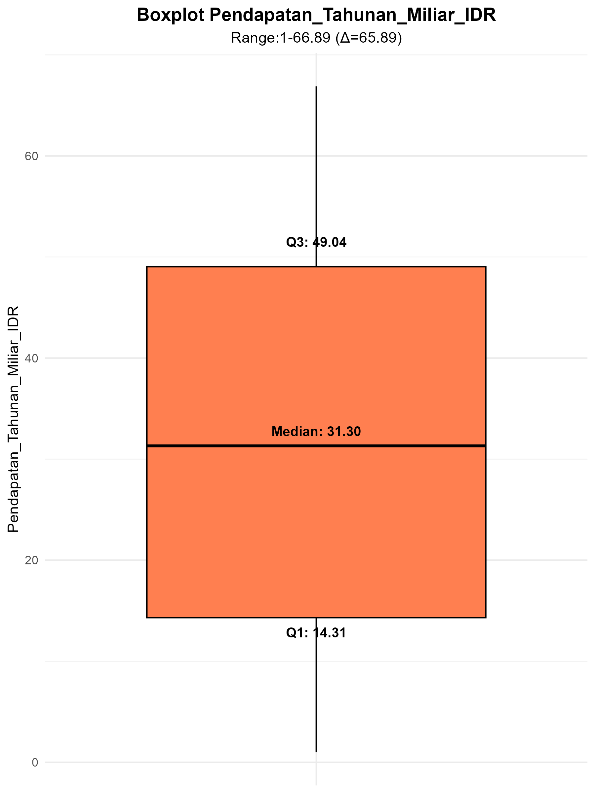
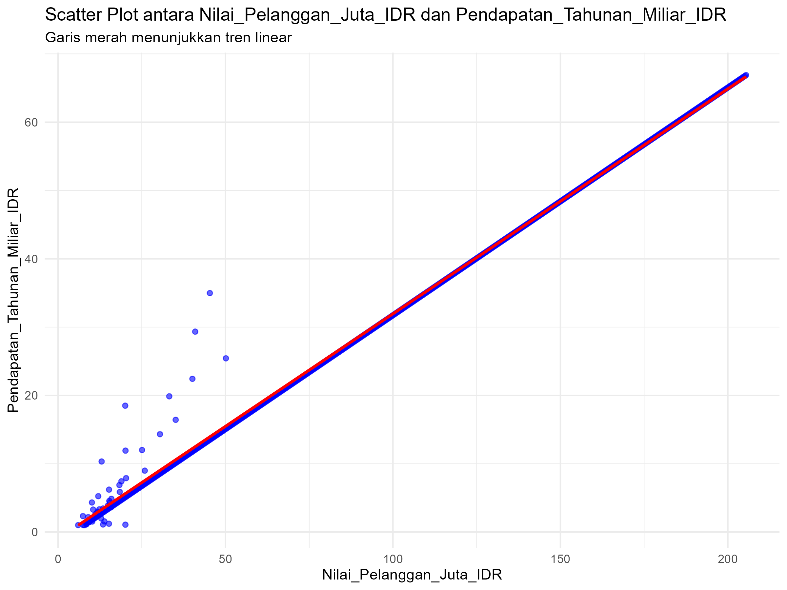

# Tugas Analisis Statistik: Deskriptif, Korelasi, dan Regresi

## 1. Informasi Penyusun

- **Nama:** Kadek Julita Widianti
- **NIM:** 2515091010
- **Program Studi:** Sistem Informasi
- **Mata Kuliah:** Statistika dan Probabilitas

---

## 2. Deskripsi Proyek

> Dataset yang digunakan dalam proyek ini adalah data_startup_saas.csv, yang berisi informasi mengenai berbagai perusahaan rintisan (startup) berbasis Software as a Service (SaaS). Dataset ini mencakup beberapa variabel penting, antara lain Nama_Startup sebagai identitas perusahaan, Kategori_Layanan yang menunjukkan jenis layanan yang ditawarkan, Pendapatan_Tahunan_Miliar_IDR sebagai ukuran pendapatan perusahaan dalam satu tahun,  Biaya_Akuisisi_Pelanggan_Juta_IDR yang menggambarkan biaya untuk memperoleh pelanggan baru, Nilai_Pelanggan_Juta_IDR yang merepresentasikan nilai ekonomi pelanggan bagi perusahaan (customer value), serta Tingkat_Churn_Persen yang menunjukkan persentase pelanggan yang berhenti menggunakan layanan.

> Dari empat variabel numerik yang tersedia (Pendapatan_Tahunan_Miliar_IDR, Biaya_Akuisisi_Pelanggan_Juta_IDR, Nilai_Pelanggan_Juta_IDR, dan Tingkat_Churn_Persen), fokus analisis ditetapkan pada variabel Pendapatan_Tahunan_Miliar_IDR sebagai variabel kunci atau utama, karena variabel tersebut berfungsi sebagai ukuran pendapatan perusahaan dalam satu tahun. Sementara itu, Nilai_Pelanggan_Juta_IDR dipilih sebagai variabel kunci kedua karena secara teoritis berperan penting dalam menentukan besarnya pendapatan yang dihasilkan perusahaan. Pemilihan variabel kunci dalam proyek ini ini difokuskan pada variabel numerik, karena metode analisis yang digunakan meliputi statistik deskriptif, uji normalitas, korelasi, dan regresi mensyaratkan data dalam bentuk numerik agar hasil analisis dapat dihitung dan diinterpretasikan secara valid.

> Tujuan utama dari proyek ini adalah untuk memahami karakteristik data melalui analisis statistik deskriptif, menguji distribusi data menggunakan uji normalitas, serta menganalisis hubungan antara Nilai_Pelanggan_Juta_IDR dan Pendapatan_Tahunan_Miliar_IDR menggunakan analisis korelasi guna mengetahui arah dan kekuatan hubungan kedua variabel tersebut. Selanjutnya, proyek ini bertujuan untuk membangun model regresi linear sederhana dengan Pendapatan_Tahunan_Miliar_IDR sebagai variabel dependen dan Nilai_Pelanggan_Juta_IDR sebagai variabel independen, guna mengevaluasi sejauh mana nilai pelanggan mampu menjelaskan variasi pendapatan tahunan startup SaaS.

> Melalui rangkaian analisis ini, diharapkan dapat diperoleh pemahaman yang lebih mendalam mengenai peran nilai pelanggan terhadap pendapatan tahunan startup SaaS, sekaligus memberikan dasar kuantitatif yang kuat dalam mendukung pengambilan keputusan dan perumusan strategi bisnis berbasis data.

---

## 3. Struktur Proyek

Proyek ini diorganisir ke dalam beberapa folder:
- `/data`: Berisi dataset mentah yang digunakan untuk analisis.
- `/scripts`: Berisi semua skrip R yang digunakan dalam analisis, diurutkan berdasarkan alur kerja.
- `/results`: Berisi output dari analisis, seperti plot, gambar, atau tabel ringkasan.

---

## 4. Cara Menjalankan Analisis

Untuk mereproduksi hasil analisis ini, ikuti langkah-langkah berikut:
1. Pastikan Anda memiliki R dan RStudio terinstal.
2. Buka proyek R ini di RStudio.
3. Instal paket yang diperlukan dengan menjalankan perintah berikut di konsol R:
   ```R
   # install.packages(c("tidyverse", "corrplot", "knitr"))
   ```
4. Jalankan skrip di dalam folder `/scripts` secara berurutan, mulai dari `01_data_preparation.R` hingga `05_analisis_regresi.R`.

---

## 5. Hasil dan Interpretasi

### 5.1. Statistik Deskriptif
> Analisis statistik deskriptif pada bagian ini difokuskan pada variabel Pendapatan_Tahunan_Miliar_IDR sebagai variabel utama penelitian.

- **Ukuran Pemusatan (Mean, Median, Modus):**
  - **Ringkasan Hasil:** Ukuran pemusatan data terhadap variabel Pendapatan_Tahunan_Miliar_IDR dari 650 startup SaaS menunjukkan nilai mean sebesar 31,88 miliar IDR, median 31,30 miliar IDR, dan modus 1,87 miliar IDR.
  - **Interpretasi:**
     Berdasarkan hasil analisis, nilai mean (31,88 miliar IDR) dan median (31,30 miliar IDR) yang relatif berdekatan menunjukkan bahwa pendapatan startup tersebar cukup merata dan tidak didominasi oleh nilai yang sangat kecil atau sangat besar. Namun, nilai modus yang jauh lebih rendah, yaitu 1,87 miliar IDR, mengindikasikan bahwa pendapatan yang paling sering muncul berada pada tingkat rendah. Hal ini mengungkap bahwa mayoritas startup SaaS masih memiliki pendapatan rendah, meskipun terdapat sejumlah startup yang telah mencapai pendapatan menengah hingga tinggi. Pola ini umum terjadi dalam startup, di mana keberhasilan segelintir perusahaan besar dapat memengaruhi statistik agregat (nilai statistik yang mewakili keseluruhan startup dalam dataset) secara signifikan. Dengan demikian, rata-rata pendapatan yang tinggi tidak serta-merta mencerminkan bahwa seluruh startup telah sukses secara finansial, melainkan merupakan hasil dari distribusi pendapatan yang tidak merata. Oleh karena itu, penggunaan mean, median, dan modus secara bersama-sama membantu memahami kondisi pendapatan startup SaaS secara lebih menyeluruh sebelum dilakukan analisis lanjutan.

- **Ukuran Sebaran (Standar Deviasi, Range, Kuartil):**
  - **Ringkasan Hasil:** Pendapatan startup SaaS menunjukkan variasi yang signifikan dengan standar deviasi sebesar 19,79 miliar IDR dan rentang yang lebar dari 1 hingga 66,89 miliar IDR (selisih 65,89 miliar IDR). Distribusi pendapatan terlihat dari ringkasan lima angka: minimum 1,00 miliar IDR, kuartil pertama (Q1) 14,31 miliar IDR, median 31,30 miliar IDR, rata-rata 31,88 miliar IDR, kuartil ketiga (Q3) 49,04 miliar IDR, dan maksimum 66,89 miliar IDR.
  - **Interpretasi:**
     Nilai standar deviasi yang cukup tinggi menunjukkan bahwa pendapatan startup SaaS sangat beragam dan tidak terkumpul pada satu tingkat tertentu. Artinya, terdapat perbedaan yang jelas antara startup dengan pendapatan rendah, menengah, dan tinggi. Rentang pendapatan yang lebar semakin menegaskan adanya kesenjangan pendapatan yang signifikan dalam startup ini. Berdasarkan ringkasan lima angka, sekitar 25% startup memiliki pendapatan di bawah 14,31 miliar IDR (Q1), yang mencerminkan kelompok startup dengan pendapatan relatif rendah. Di sisi lain, sekitar 25% startup memiliki pendapatan di atas 49,04 miliar IDR (Q3), yang menunjukkan kelompok startup dengan pendapatan tinggi. Sementara itu, 50% startup lainnya berada di antara kedua nilai tersebut, dengan nilai tengah pendapatan berada pada sekitar 31,30 miliar IDR per tahun. Secara keseluruhan, hasil ini menunjukkan bahwa kondisi startup SaaS ini memiliki kesenjangan pendapatan yang cukup besar. Terdapat kelompok startup dengan pendapatan rendah, kelompok menengah yang relatif stabil, dan kelompok kecil startup dengan pendapatan sangat tinggi. Oleh karena itu, meskipun rata-rata pendapatan industri terlihat cukup besar, nilai tersebut tidak sepenuhnya mencerminkan kondisi seluruh startup. Pemahaman terhadap penyebaran data ini penting agar analisis lanjutan tidak hanya bergantung pada nilai rata-rata, tetapi juga mempertimbangkan variasi dan kesenjangan yang ada.
    
- **Visualisasi Histogram:**
  - **Histogram Distibusi Pendapatan_Tahunan_Miliar_IDR**

     
     
  - **Interpretasi:**
    Histogram distribusi pendapatan tahunan startup SaaS menunjukkan bahwa nilai pendapatan tersebar dari tingkat yang rendah hingga tinggi, tanpa terpusat pada satu nilai tertentu. Garis putus-putus hitam pada grafik menandai nilai mean sebesar 31,88 miliar IDR, yang berada di sekitar tengah sebaran data dan sangat dekat dengan nilai median sebesar 31,30 miliar IDR yang ditunjukan oleh garis merah. Kedekatan antara nilai mean dan median ini menunjukkan bahwa distribusi pendapatan tidak terlalu dipengaruhi oleh nilai ekstrem dan relatif seimbang.
    Meskipun demikian, histogram memperlihatkan bahwa frekuensi startup dengan pendapatan rendah hingga menengah relatif lebih tinggi dibandingkan startup dengan pendapatan tinggi. Hal ini ditunjukkan oleh kepadatan batang histogram pada sisi kiri hingga tengah distribusi, serta nilai modus yang berada pada kisaran pendapatan rendah. Kondisi tersebut mengindikasikan bahwa sebagian besar startup masih berada pada tahap pendapatan yang relatif kecil hingga menengah.
  Secara keseluruhan, histogram memperlihatkan bahwa pendapatan startup SaaS belum merata. Sebagian besar startup masih berada pada level pendapatan rendah hingga menengah, sementara hanya sebagian kecil startup dengan pendapatan tinggi yang mendorong nilai rata-rata menjadi lebih besar. Pola ini menegaskan adanya kesenjangan pendapatan dalam startup SaaS, meskipun distribusi data secara umum tidak menunjukkan kemiringan yang ekstrem atau sebaran data yang tidak merata.
    

    
- **Visualisasi Boxplot:**
  - **Boxplot Pendapatan_Tahunan_Miliar_IDR**
    
      
      
  - **Interpretasi:**
    Berdasarkan boxplot pendapatan tahunan startup SaaS, nilai median pendapatan berada pada sekitar 31,30 miliar rupiah per tahun, yang menunjukkan bahwa 50% startup memiliki pendapatan di bawah nilai tersebut dan 50% lainnya berada di atasnya. Sebaran data pendapatan ditunjukkan oleh rentang range dari 1 hingga 66,89 miliar IDR (selisih 65,89 miliar IDR), dengan kuartil pertama (Q1) sebesar 14,31 miliar IDR dan kuartil ketiga (Q3) sebesar 49,04 miliar IDR. Hal ini berarti bahwa 50% startup berada pada rentang pendapatan antara 14,31 hingga 49,04 miliar IDR per tahun, yang merupakan kelompok tengah dari keseluruhan data.
    
    Sementara itu, 50% startup lainnya berada di luar rentang tersebut, yaitu:
    - 25% startup memiliki pendapatan tahunan di bawah 14,31 miliar IDR, yang mencerminkan kelompok startup dengan pendapatan relatif rendah, dan
    - 25% startup memiliki pendapatan tahunan di atas 49,04 miliar IDR, yang menunjukkan kelompok startup dengan pendapatan relatif tinggi.
      
    Selain itu, rentang pendapatan secara keseluruhan cukup lebar, yaitu dari sekitar 1 miliar IDR hingga 66,89 miliar IDR per tahun, yang mengindikasikan adanya kesenjangan pendapatan yang cukup besar antar startup SaaS yang diamati. Secara keseluruhan, boxplot ini menunjukkan bahwa pendapatan tahunan startup SaaS memiliki variasi yang tinggi, dengan perbedaan yang jelas antara kelompok startup berpendapatan rendah, menengah, dan tinggi.
  

### 5.2. Uji Normalitas
> Uji normalitas dilakukan terhadap variabel Pendapatan_Tahunan_Miliar_IDR, karena variabel ini menjadi dasar dalam analisis korelasi dan regresi selanjutnya.

- **Hasil Uji Shapiro-Wilk:**
  - **Nilai p-value:** sebesar 1,497e-14
  - **Interpretasi:**
    Nilai p-value yang jauh lebih kecil dari tingkat signifikansi 0,05 menunjukkan bahwa data pendapatan tahunan tidak terdistribusi normal. Hal ini berarti sebaran data tidak membentuk pola simetris seperti distribusi normal dan kemungkinan dipengaruhi oleh perbedaan pendapatan yang cukup besar antar startup, termasuk adanya beberapa nilai pendapatan yang sangat tinggi dibandingkan mayoritas data lainnya. Ketidaknormalan distribusi data ini memiliki implikasi penting terhadap metode analisis yang digunakan pada tahap selanjutnya, yaitu analisis korelasi. Dalam analisis korelasi untuk proyek ini diberikan dua pilihan untuk menggunakan dua metode yaitu metode Pearson dan Spearman. Karena korelasi dengan metode Pearson mensyaratkan data berdistribusi normal, maka metode tersebut tidak sesuai untuk digunakan pada data ini. Oleh karena itu, analisis korelasi dalam proyek ini menggunakan korelasi dengan metode Spearman, yang tidak bergantung pada asumsi normalitas dan lebih stabil terhadap distribusi data yang tidak simetris serta keberadaan nilai ekstrem. Pemilihan metode ini bertujuan untuk menghasilkan analisis hubungan antar variabel yang lebih akurat dan representatif sesuai dengan karakteristik data pendapatan startup SaaS.
    
- **Plot Q-Q:**
  - **Plot Q-Q Uji Normalitas**

    
    
    
  - **Interpretasi:**
    Berdasarkan Q-Q Plot variabel Pendapatan_Tahunan_Miliar_IDR, terlihat bahwa sebagian besar titik-titik data tidak mengikuti garis diagonal secara konsisten. Pada bagian tengah, beberapa titik masih mendekati garis, namun pada bagian awal dan terutama bagian akhir, titik-titik mulai menyimpang cukup jauh dari garis lurus/garis diagonal. Penyimpangan yang jelas di sisi kanan menunjukkan adanya nilai pendapatan yang sangat tinggi dibandingkan mayoritas data. Pola ini menandakan bahwa distribusi data tidak simetris dan memiliki ekor kanan yang panjang (right-skewed). Dengan kata lain, terdapat sejumlah startup dengan pendapatan jauh lebih besar yang menyebabkan bentuk distribusi menyimpang dari distribusi normal. Hasil visual ini sejalan dengan temuan pada uji Shapiro-Wilk yang menyatakan bahwa data tidak terdistribusi normal. Sehingga hal ini akan mempengaruhi analisis selanjutnya yaitu analisis korelasi yang lebih tepat menggunakan metode Spearman karena distribusi data yang tidak normal.
    
### 5.3. Analisis Korelasi
> Pada tahap analisis korelasi ini, fokus analisis diarahkan pada hubungan antara Nilai_Pelanggan_Juta_IDR dan Pendapatan_Tahunan_Miliar_IDR. Pemilihan kedua variabel ini didasarkan pada asumsi bahwa nilai ekonomi pelanggan memiliki keterkaitan langsung dengan pendapatan yang dihasilkan oleh startup SaaS. Mengingat hasil uji normalitas menunjukkan bahwa data pendapatan tidak terdistribusi normal, maka metode korelasi yang digunakan dalam analisis ini adalah korelasi Spearman.

- **Nilai Koefisien Korelasi:**
  - **Nilai r:** 0,997  
  - **Interpretasi:**
    Nilai koefisien korelasi sebesar 0,997 menunjukkan hubungan yang **sangat kuat dan positif** antara variabel Nilai_Pelanggan_Juta_IDR dan Pendapatan_Tahunan_Miliar_IDR. Artinya, semakin tinggi nilai pelanggan, semakin besar pula pendapatan tahunan startup.
    
- **Visualisasi (Scatter Plot):**
  - **Scatter Plot Korelasi**

     
    
  - **Interpretasi:**
    Scatter plot antara Nilai_Pelanggan_Juta_IDR dan Pendapatan_Tahunan_Miliar_IDR menunjukkan pola titik yang membentuk tren menaik yang jelas. Titik-titik data tidak tersebar secara acak, melainkan cenderung berkumpul dan mengikuti arah kenaikan yang konsisten, yang menunjukkan bahwa peningkatan nilai pelanggan diikuti oleh peningkatan pendapatan tahunan. Meskipun analisis korelasi menggunakan metode Spearman, yang mengukur hubungan monotonik berdasarkan peringkat data dan tidak mensyaratkan hubungan linear sempurna, garis tren linear (lm) tetap ditampilkan pada scatter plot sebagai alat bantu visual untuk memperjelas arah umum hubungan antarvariabel. Garis ini tidak digunakan dalam perhitungan korelasi, tetapi membantu menunjukkan bahwa hubungan kedua variabel bersifat positif dan stabil.Kesesuaian antara pola visual pada scatter plot dan nilai koefisien korelasi Spearman yang tinggi memperkuat kesimpulan bahwa semakin tinggi nilai pelanggan, semakin besar juga pendapatan tahunan startup SaaS.
    
### 5.4. Analisis Regresi
>  Analisis regresi linear sederhana dalam penelitian ini bertujuan untuk mengkaji pengaruh Nilai_Pelanggan_Juta_IDR sebagai variabel independen terhadap Pendapatan_Tahunan_Miliar_IDR sebagai variabel dependen. Pemodelan ini dilakukan untuk mengetahui sejauh mana variasi pendapatan tahunan startup SaaS dapat dijelaskan oleh nilai pelanggan. Meskipun hasil uji normalitas menunjukkan bahwa data tidak sepenuhnya berdistribusi normal, analisis regresi linear tetap dilakukan karena yang diperhatikan dalam regresi adalah apakah hasil prediksi model tidak menyimpang secara ekstrem dari data sebenarnya. Selama selisih antara nilai pendapatan yang diprediksi dan nilai pendapatan aktual masih tersebar secara wajar, regresi linear tetap dapat digunakan untuk menjelaskan hubungan antara nilai pelanggan dan pendapatan tahunan startup SaaS.

- **Model Regresi:**
  - **Persamaan regresi: Y = b0 + b1*X**
    
    Persamaan regresi: Pendapatan_Tahunan_Miliar_IDR = −0,99 + 0,33 × Nilai_Pelanggan_Juta_IDR
  - **Interpretasi:**
    Koefisien slope (b1) sebesar 0,33 menunjukkan bahwa setiap kenaikan 1 juta IDR nilai pelanggan diperkirakan akan meningkatkan pendapatan tahunan sebesar 0,33 miliar IDR. Hal ini mengindikasikan adanya hubungan positif dan searah antara nilai pelanggan dan pendapatan, di mana peningkatan nilai pelanggan berkontribusi langsung terhadap peningkatan pendapatan perusahaan.Sementara itu, nilai intercept (b0) sebesar −0,99 menunjukkan titik potong model regresi pada sumbu pendapatan saat nilai pelanggan bernilai nol. Nilai ini tidak diinterpretasikan secara langsung secara bisnis, tetapi diperlukan secara matematis untuk membentuk model regresi.
    
- **Evaluasi Model (R-squared):**
  - **Nilai R-squared:** 0,994 (99,4%)
  - **Interpretasi:**
    Nilai R-squared sebesar 0,994 menunjukkan bahwa model regresi linear mampu menjelaskan sekitar 99,4% variasi pendapatan tahunan startup SaaS berdasarkan nilai pelanggan. Hal ini menandakan bahwa nilai pelanggan memiliki pengaruh yang sangat kuat terhadap pendapatan dalam model yang digunakan, sementara hanya sebagian kecil variasi pendapatan yang dijelaskan oleh faktor lain di luar model.
    
- **Visualisasi (Garis Regresi pada Scatter Plot):**
  - **Scatter Plot Regresi**
 
     
     
  - **Interpretasi:**
    Grafik menunjukkan adanya hubungan linear positif yang sangat kuat antara nilai pelanggan dan pendapatan tahunan startup SaaS. Titik-titik data sebagian besar berada sangat dekat dengan garis regresi, yang menandakan bahwa model regresi mampu merepresentasikan hubungan kedua variabel dengan baik. Garis regresi yang menanjak menunjukkan bahwa semakin tinggi nilai pelanggan, semakin tinggi pula pendapatan tahunan yang dihasilkan. Nilai Adjusted R-squared sebesar 0,994 (99,4%) memperkuat temuan ini, karena menunjukkan bahwa hampir seluruh variasi pendapatan tahunan dapat dijelaskan oleh variasi nilai pelanggan dalam model. Penyimpangan titik data dari garis regresi relatif kecil, sehingga kesalahan prediksi model tergolong rendah. Secara keseluruhan, grafik ini menegaskan bahwa nilai pelanggan dapat menjelaskan hampir keseluruhan variasi pendapatan tahunan. 

---

## 6. Kesimpulan

Berdasarkan rangkaian analisis statistik yang telah dilakukan terhadap dataset startup SaaS, dapat disimpulkan bahwa pendapatan tahunan startup menunjukkan karakteristik distribusi yang tidak merata dengan tingkat variasi yang cukup tinggi. Analisis statistik deskriptif terhadap variabel Pendapatan_Tahunan_Miliar_IDR memperlihatkan bahwa meskipun nilai rata-rata (31,88 miliar IDR) dan median (31,30 miliar IDR) pendapatan berada pada kisaran menengah, nilai modus (1,87 miliar IDR) yang jauh lebih rendah mengindikasikan bahwa sebagian besar startup masih berada pada level pendapatan rendah. Hal ini menunjukkan adanya kesenjangan pendapatan yang cukup signifikan antar startup SaaS, di mana hanya sebagian kecil perusahaan dengan pendapatan tinggi yang mendorong nilai rata-rata keseluruhan menjadi lebih besar. Temuan ini menegaskan bahwa penggunaan ukuran pemusatan saja tidak cukup untuk menggambarkan kondisi finansial startup secara menyeluruh tanpa mempertimbangkan sebaran data.
<Details><Summary>Klik untuk melihat details</Summary>

Hasil uji normalitas menggunakan metode Shapiro-Wilk dan didukung oleh visualisasi Q-Q plot menunjukkan bahwa data pendapatan tahunan tidak terdistribusi normal dan cenderung memiliki kemiringan ke kanan (right-skewed) walaupun tidak ekstrem. Ketidaknormalan distribusi ini dipengaruhi oleh keberadaan sejumlah startup dengan pendapatan yang sangat tinggi dibandingkan mayoritas data lainnya. Oleh karena itu, pemilihan metode analisis lanjutan disesuaikan dengan karakteristik data, khususnya dalam analisis korelasi yang menggunakan metode Spearman. Penggunaan korelasi Spearman dinilai lebih tepat karena metode ini tidak mensyaratkan distribusi normal dan mengukur hubungan monotonik berdasarkan peringkat data, sehingga lebih stabil terhadap data yang tidak simetris dan keberadaan nilai ekstrem.

Analisis korelasi Spearman antara Nilai_Pelanggan_Juta_IDR dan Pendapatan_Tahunan_Miliar_IDR menghasilkan koefisien korelasi sebesar 0,997, yang menunjukkan adanya hubungan positif yang sangat kuat antara kedua variabel tersebut. Scatter plot yang dihasilkan memperlihatkan pola titik yang membentuk tren menaik yang jelas dan konsisten, di mana peningkatan nilai pelanggan diikuti oleh peningkatan pendapatan tahunan. Meskipun korelasi Spearman tidak mengukur hubungan linear secara langsung, visualisasi scatter plot dengan garis tren linear digunakan sebagai alat bantu untuk memperjelas arah umum hubungan antarvariabel. Kesesuaian antara pola visual dan nilai koefisien korelasi yang sangat tinggi memperkuat kesimpulan bahwa nilai pelanggan memiliki keterkaitan yang erat dengan pendapatan tahunan startup SaaS.

Selanjutnya, analisis regresi linear sederhana dilakukan untuk mengevaluasi sejauh mana Nilai_Pelanggan_Juta_IDR mampu menjelaskan variasi Pendapatan_Tahunan_Miliar_IDR. Hasil pemodelan menunjukkan persamaan regresi dengan koefisien slope positif, yang mengindikasikan bahwa setiap peningkatan 1 juta IDR nilai pelanggan diikuti oleh peningkatan pendapatan tahunan sebesar 0,33 miliar IDR. Nilai koefisien determinasi (R-squared) sebesar 0,994 menunjukkan bahwa sekitar 99,4% variasi pendapatan tahunan dapat dijelaskan oleh nilai pelanggan dalam model ini. Visualisasi garis regresi yang memperlihatkan titik-titik data berada sangat dekat dengan garis regresi menandakan bahwa model memiliki tingkat kesesuaian yang sangat tinggi dan kesalahan prediksi yang relatif kecil.

Secara keseluruhan, hasil analisis ini menunjukkan bahwa nilai pelanggan merupakan faktor yang sangat penting dalam menjelaskan pendapatan tahunan startup SaaS. Temuan ini memberikan dasar kuantitatif yang kuat bahwa peningkatan nilai pelanggan berpotensi berkontribusi secara signifikan terhadap pertumbuhan pendapatan perusahaan. Dengan demikian, bagi startup SaaS, strategi bisnis yang berfokus pada peningkatan nilai pelanggan dapat menjadi salah satu pendekatan utama dalam mendorong kinerja finansial secara berkelanjutan. Analisis ini juga menegaskan pentingnya penggunaan metode statistik yang sesuai dengan karakteristik data agar kesimpulan yang dihasilkan lebih akurat dan dapat dipertanggungjawabkan secara ilmiah.
</Details>


